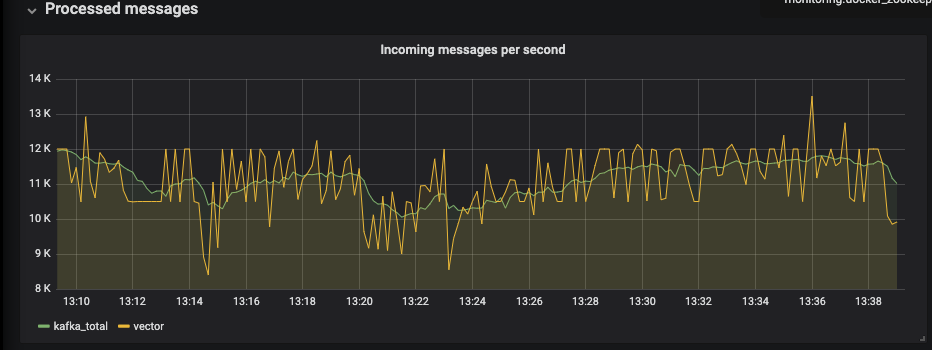
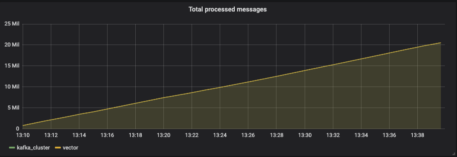
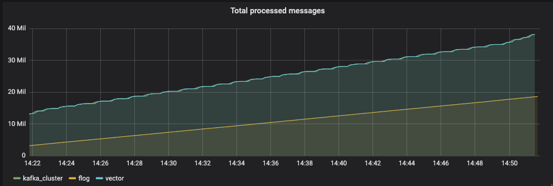

### Log collector comparision

So, several weeks ago, we had a meeting where it was said, that BI-team would take some time and dig deeper into several ubiquitous lightweight log collectors. We have taken a look at:
* Vector
* Fluent-Bit
* FluentD
* FileBeat

And after some research and testing we could positively say, that vector seems to meet our requirements more than any other piece of software, we have taken a look at.

Vector is extremely easy to install and deploy. It's an open source project which haven't been released yet, but it performs fairly well even compared to the more stable and well-known alternatives. As per one of our main requirements, vector handles file rotation extremely well, using file checksum (a unique identifier, generated from the first X characters of the file) by default. This mechanism can be switched to file identification by device and inode if we find it more appealing.
Also, vector can sink logs to kafka and s3 out of the box. In case kafka broker or s3 bucket is unavailable, there is an ability to persist data on a disk (sink-based configuration) and to re-send them once connection is re-established.

But there are several things vector (currently) lacks. First and one of the most notable ones is built-in monitoring. Unfortunately, as of now, there is no available http-server with source/sink-specific metrics you can query to get performance data. However, there is a workaround: you can convert your logs into metrics using transfrom plugin of the same name and then feed them to your prefered metric aggregator. When testing I did the same with the following chain:
```
vector log -> vector metric -> prometheus sink -> telegraf prometheus input -> influxdb output
```

The other rather big issue with vector is that it's written in Rust and as of now has no support for GCP products. However, they are open to pull requests that add the necessary functionality and adding support for google cloud services recently has become one of their [milestones](https://github.com/timberio/vector/milestone/17). So we could either give them a hand or just wait until those guys will develop everything on their own.

### A small note about performance
I have been testing vector with about 10-15k rpm on a Ubuntu-based vagrant box. An example graph on how vector/kafka handled these metrics on a per-second basis can be found below:



*Here vector had to deal with approximately 12k logs per second*

It had 2 cpu cores and 2 gigs of RAM. Log generation was done with my fork of [flog](https://github.com/mingrammer/flog) that was modified a little to send metrics to telegraf. And under these conditions, vector was stressing CPU up to 150% while not using almost any memory at all (something along the lines of 250 - 300 mb). I was also running everything in docker, so small amount of CPU usage can be addressed to that.


*Please, note that on these graphs I capture the all-time max usage of CPU and memory respectively*

Flog logs received by vector were sent to kafka and converted to metrics which were in turn fed to telegraf. Lag was minimal: events were sent to kafka cluster almost instantly, and difference (in Influxdb metrics) between the lines read from file and sent to kafka was from 0 to 0.05% (almost always, on the next tick the difference disappeared).



*As you can see, there is no visible lag between vector and kafka*

But what if we compare it to fluent(-bit/D)? They are both a very good solution for log collection, hovewer, their tail plugin is poorly suited to handling rotating files and it's recommended by documentation to always point it to the latest file. If we specify file mask (e.g `/var/log/test_log*`), both of theese products will try to send the newly-rotated file in it's entirety to specified sinks, which is bad for obvious reasons.



*For that test I have turned on flog metrics just to illustrate the point of fluent-bit duplicating rotating logs*

FileBeat, on the other hand is a great solution that handles rotating files well and doesn't require a lot of resources to get running. Hovewer, it has no support of Google Pub/Sub and I am not sure that the most recent version of FileBeat supports writing your custom output plugins. In older versions, you could just create your custom output plugin and pass the compiled binary's path at the runtime to the filebeat executable. So we could always look at FileBeat as a solid back-up alternative to Vector in case anything goes wrong.

But, I think Vector - is a fast and powerful log collector solution, albeit young and written in a language, we don't often use here at Wix.
